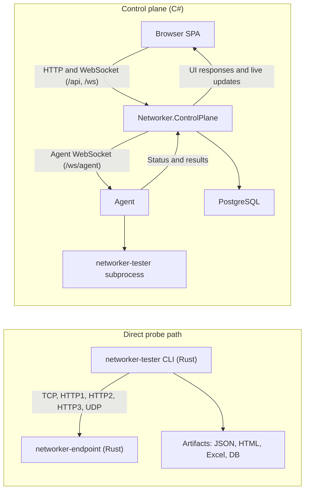

# LagHound

**LagHound** is a cross-platform network diagnostics suite for measuring TCP, HTTP/1.1,
HTTP/2, HTTP/3, UDP, page-load, throughput, TLS, and URL-diagnostic behavior.
The CLI probe engine ships as `networker-tester`.

> **Brand:** the product is **LagHound** (renamed from Networker, 2026-07) —
> one name across the tester, the dashboard/control plane, and the benchmark
> suite (binary `alethabench`). Infrastructure identifiers keep their
> historical names: the repo and crates stay `networker-*`, C# projects stay
> `Networker.*`, and `alethedash.com` is the current production deployment's
> domain, not a product name. See [`docs/branding.md`](docs/branding.md).

The repository is a hybrid Rust + C# system:
- `networker-tester` (Rust): the CLI probe engine — runs probes and writes JSON, HTML, Excel, and DB output. This is the permanent measurement core.
- `networker-endpoint` (Rust): the server used as the diagnostic target
- `Networker.ControlPlane` (C#, ASP.NET): the production control plane — REST API, raw-WebSocket hubs, JWT auth, scheduling, provisioning, and background loops over PostgreSQL
- `Networker.Agent` (C#): a worker that connects to the control plane and runs tester jobs
- `Networker.Contracts` / `Networker.Data` / `Networker.Security` (C#): the versioned JSON seam, EF Core model, and crypto shared by the C# services

The legacy Rust control plane (`networker-dashboard`, `networker-agent`,
`networker-common`) has been replaced by the C# solution and is pending
decommission — the crates remain in the tree for the soak/rollback window
(see `docs/phase2-cutover-runbook.md`; full-Rust snapshot at the
`rust-legacy-*` tag and `legacy/rust` branch).

## Architecture



There are two main ways to use the system:
- Direct mode: run `networker-tester` yourself against `networker-endpoint` or another target and collect artifacts locally.
- Managed mode: use the browser UI and the control plane to dispatch runs to agents, which execute `networker-tester` and stream results back live.

More detail is in [`docs/architecture.md`](docs/architecture.md).

## Install

### macOS and Linux

```bash
curl -fsSL https://gist.githubusercontent.com/irlm/37a1af64b70ef6e58ea117839407f4f9/raw/install.sh | bash -s -- tester
curl -fsSL https://gist.githubusercontent.com/irlm/37a1af64b70ef6e58ea117839407f4f9/raw/install.sh | bash -s -- endpoint
```

### Windows PowerShell

```powershell
$GistUrl = 'https://gist.githubusercontent.com/irlm/37a1af64b70ef6e58ea117839407f4f9/raw/install.ps1'
Invoke-RestMethod $GistUrl | Invoke-Expression
Invoke-WebRequest $GistUrl -OutFile "$env:TEMP\networker-install.ps1"
& "$env:TEMP\networker-install.ps1" -Component endpoint
```

### Build from source

```bash
git clone git@github.com:irlm/networker-tester.git
cd networker-tester

# Rust probe engine + endpoint
cargo build --release -p networker-tester -p networker-endpoint

# C# control plane + agent (requires .NET 10 SDK)
dotnet build Networker.sln -c Release
```

Main binaries:
- `target/release/networker-tester`
- `target/release/networker-endpoint`
- `src/Networker.ControlPlane/bin/Release/net10.0/Networker.ControlPlane`
- `src/Networker.Agent/bin/Release/net10.0/Networker.Agent`

## Quick Start

Start a local endpoint:

```bash
./target/release/networker-endpoint
```

Run a few probes:

```bash
./target/release/networker-tester \
  --target https://127.0.0.1:8443/health \
  --modes tcp,http1,http2,http3,udp,pageload,pageload2,pageload3 \
  --payload-sizes 1m \
  --runs 3 \
  --insecure
```

Open the generated report:

```bash
open output/report.html
```

## Config Files

Checked-in sample configs now live in [`examples/configs/`](examples/configs/).

Common starting points:
- [`examples/configs/tester.example.json`](examples/configs/tester.example.json)
- [`examples/configs/endpoint.example.json`](examples/configs/endpoint.example.json)
- [`examples/configs/deploy.example.json`](examples/configs/deploy.example.json)
- [`examples/configs/deploy-lan.json`](examples/configs/deploy-lan.json)
- [`examples/configs/deploy-multi-cloud.json`](examples/configs/deploy-multi-cloud.json)

The installer may generate a local `networker-cloud.json` during deployment workflows. That file is
an output artifact, not a checked-in sample.

## Documentation

Detailed documentation lives under [`docs/`](docs/):
- [`docs/README.md`](docs/README.md): docs index
- [`docs/architecture.md`](docs/architecture.md): component relationships and runtime flow
- [`docs/installation.md`](docs/installation.md): installation, build, and component startup
- [`docs/release-flow.md`](docs/release-flow.md): version bump, auto-tag, deploy-first release graph, rollback
- [`docs/probes.md`](docs/probes.md): probe and metric reference
- [`docs/testing.md`](docs/testing.md): protocol-comparison and benchmarking workflows
- [`docs/deploy-config.md`](docs/deploy-config.md): `--deploy` JSON schema and execution model
- [`docs/config-examples.md`](docs/config-examples.md): sample config catalog
- [`docs/cloud-auth.md`](docs/cloud-auth.md): cloud federation details

## Repository Layout

```text
crates/
  networker-tester/     CLI probe engine and output writers (the Rust core)
  networker-endpoint/   HTTP/HTTPS/UDP diagnostic target server
  networker-common/     LEGACY: shared message types (Rust dashboard <-> agent)
  networker-dashboard/  LEGACY: replaced by Networker.ControlPlane, pending decommission
  networker-agent/      LEGACY: replaced by Networker.Agent, pending decommission
src/
  Networker.ControlPlane/  C# control plane: REST, WS hubs, auth, scheduling, provisioning
  Networker.Agent/         C# worker daemon that runs tester jobs
  Networker.Endpoint/      C# port of the diagnostic target server
  Networker.Contracts/     Versioned JSON seam (tester --json contract)
  Networker.Data/          EF Core model (database-first from the live schema)
  Networker.Security/      Credential cipher + auth crypto
tests/                  C# test projects + installer/endpoint/integration tests
dashboard/              React + TypeScript + Vite frontend (Tailwind dark theme)
docs/                   Detailed documentation
examples/configs/       Checked-in sample JSON configs
scripts/                Deployment and maintenance scripts
```

## Control Plane Quick Start

The C# control plane requires PostgreSQL, .NET 10, and a few environment variables:

```bash
# 1. Start PostgreSQL
docker compose -f docker-compose.dashboard.yml up -d postgres

# 2. Start the endpoint (test target)
cargo run -p networker-endpoint

# 3. Start the control plane (port 5030)
DASHBOARD_JWT_SECRET=$(openssl rand -base64 32) \
DASHBOARD_CREDENTIAL_KEY=$(openssl rand -hex 32) \
ASPNETCORE_URLS=http://0.0.0.0:5030 \
  dotnet run --project src/Networker.ControlPlane

# 4. Start an agent (connects to the control plane's raw agent WebSocket)
AGENT_API_KEY=dev-key AGENT_DASHBOARD_URL=ws://localhost:5030/ws/agent \
  dotnet run --project src/Networker.Agent

# 5. Start the frontend dev server (port 5173, proxies /api and /ws)
cd dashboard && npm install && npm run dev
```

Key environment variables:

| Variable | Required | Default | Description |
|----------|----------|---------|-------------|
| `DASHBOARD_DB_URL_NPGSQL` | no | localhost dev defaults | Npgsql connection string (`Host=…;Database=…;Username=…;Password=…`) |
| `DASHBOARD_JWT_SECRET` | yes (prod) | -- | HS256 JWT signing secret — fail-closed outside Development |
| `DASHBOARD_CREDENTIAL_KEY` | yes (prod) | -- | 64-hex AEAD key for cloud-account secrets — fail-closed outside Development |
| `ASPNETCORE_URLS` | no | `http://localhost:5000` | Listen address, e.g. `http://0.0.0.0:5030` |
| `DASHBOARD_BACKGROUND_SERVICES` | no | on | Set `0` for an API-only replica (no scheduler/watchdog/reaper loops) |
| `AGENT_DASHBOARD_URL` | no | `ws://localhost:3000/ws/agent` | Full agent WebSocket URL (also accepted: `AGENT_DASHBOARDURL`) |
| `AGENT_API_KEY` | yes | -- | Agent authentication key, validated against `agent.api_key` (also accepted: `AGENT_APIKEY`) |

See [`docs/phase2-cutover-runbook.md`](docs/phase2-cutover-runbook.md) for
production operations and [`docs/setup-guide.md`](docs/setup-guide.md) for
deployment.

## Development

```bash
# Rust (probe engine + endpoint)
cargo test -p networker-tester -p networker-endpoint --lib

# C# (control plane, agent, endpoint port, contracts)
dotnet test Networker.sln

# Frontend
cd dashboard && npm install && npm run build
```

For deeper usage, deployment, and benchmarking guidance, start with
[`docs/README.md`](docs/README.md).
