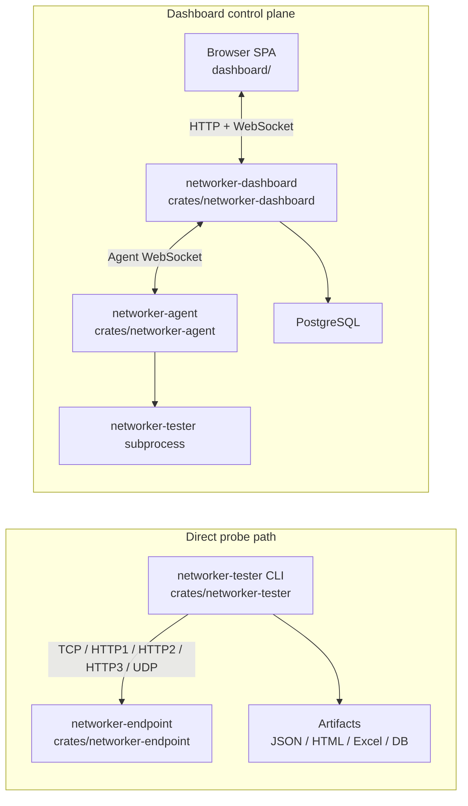

# Networker Tester

`networker-tester` is a cross-platform network diagnostics suite for measuring TCP, HTTP/1.1,
HTTP/2, HTTP/3, UDP, page-load, throughput, TLS, and URL-diagnostic behavior.

The repository includes:
- `networker-tester`: the Rust CLI that runs probes and writes JSON, HTML, Excel, and DB output
- `networker-endpoint`: the Rust server used as the diagnostic target
- `networker-dashboard`: an axum + React control plane for agents, runs, deployments, and schedules
- `networker-agent`: a worker that connects to the dashboard and runs tester jobs

## Architecture



There are two main ways to use the system:
- Direct mode: run `networker-tester` yourself against `networker-endpoint` or another target and collect artifacts locally.
- Managed mode: use the browser UI and `networker-dashboard` to dispatch runs to `networker-agent`, which executes `networker-tester` and streams results back live.

More detail is in [`docs/architecture.md`](docs/architecture.md).

## Install

### macOS and Linux

```bash
curl -fsSL https://gist.githubusercontent.com/irlm/37a1af64b70ef6e58ea117839407f4f9/raw/install.sh | bash -s -- tester
curl -fsSL https://gist.githubusercontent.com/irlm/37a1af64b70ef6e58ea117839407f4f9/raw/install.sh | bash -s -- endpoint
```

### Windows PowerShell

```powershell
$GistUrl = 'https://gist.githubusercontent.com/irlm/37a1af64b70ef6e58ea117839407f4f9/raw/install.ps1'
Invoke-RestMethod $GistUrl | Invoke-Expression
Invoke-WebRequest $GistUrl -OutFile "$env:TEMP\networker-install.ps1"
& "$env:TEMP\networker-install.ps1" -Component endpoint
```

### Build from source

```bash
git clone git@github.com:irlm/networker-tester.git
cd networker-tester
cargo build --release
```

Main binaries:
- `target/release/networker-tester`
- `target/release/networker-endpoint`
- `target/release/networker-dashboard`
- `target/release/networker-agent`

## Quick Start

Start a local endpoint:

```bash
./target/release/networker-endpoint
```

Run a few probes:

```bash
./target/release/networker-tester \
  --target https://127.0.0.1:8443/health \
  --modes tcp,http1,http2,http3,udp,pageload,pageload2,pageload3 \
  --payload-sizes 1m \
  --runs 3 \
  --insecure
```

Open the generated report:

```bash
open output/report.html
```

## Config Files

Checked-in sample configs now live in [`examples/configs/`](examples/configs/).

Common starting points:
- [`examples/configs/tester.example.json`](examples/configs/tester.example.json)
- [`examples/configs/endpoint.example.json`](examples/configs/endpoint.example.json)
- [`examples/configs/deploy.example.json`](examples/configs/deploy.example.json)
- [`examples/configs/deploy-lan.json`](examples/configs/deploy-lan.json)
- [`examples/configs/deploy-multi-cloud.json`](examples/configs/deploy-multi-cloud.json)

The installer may generate a local `networker-cloud.json` during deployment workflows. That file is
an output artifact, not a checked-in sample.

## Documentation

Detailed documentation lives under [`docs/`](docs/):
- [`docs/README.md`](docs/README.md): docs index
- [`docs/architecture.md`](docs/architecture.md): component relationships and runtime flow
- [`docs/installation.md`](docs/installation.md): installation, build, and component startup
- [`docs/probes.md`](docs/probes.md): probe and metric reference
- [`docs/testing.md`](docs/testing.md): protocol-comparison and benchmarking workflows
- [`docs/deploy-config.md`](docs/deploy-config.md): `--deploy` JSON schema and execution model
- [`docs/config-examples.md`](docs/config-examples.md): sample config catalog
- [`docs/cloud-auth.md`](docs/cloud-auth.md): cloud federation details

## Repository Layout

```text
crates/
  networker-tester/
  networker-endpoint/
  networker-dashboard/
  networker-agent/
  networker-common/
dashboard/              React SPA for the dashboard
docs/                   Detailed documentation
examples/configs/       Checked-in sample JSON configs
tests/                  Installer, endpoint, and integration tests
```

## Development

```bash
cargo test
cd dashboard && npm install && npm run build
```

For deeper usage, deployment, and benchmarking guidance, start with
[`docs/README.md`](docs/README.md).
