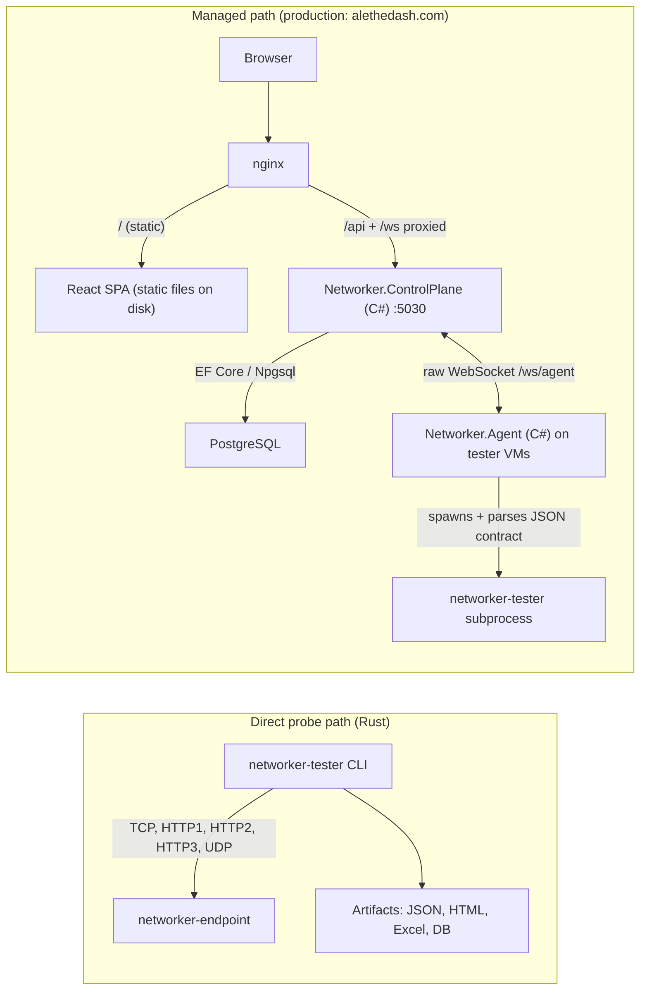
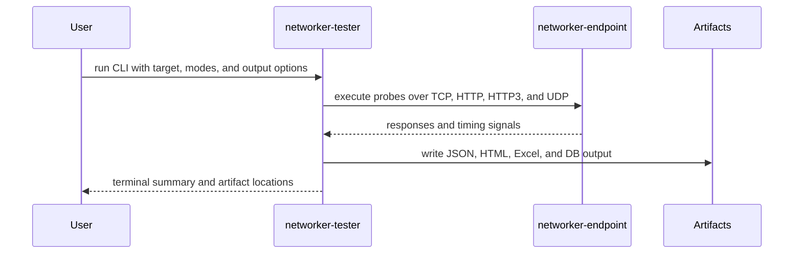
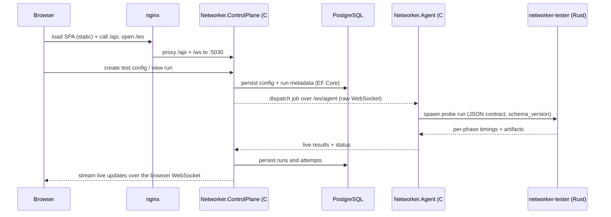
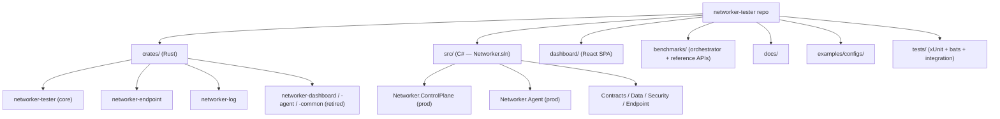

# Architecture

The system is a **hybrid Rust + C# platform** with two closely related runtime paths:
the direct probe path (Rust) and the managed control-plane path (C#).

- **Rust** owns measurement: `networker-tester` (the probe engine) and
  `networker-endpoint` (the diagnostic target). These are the permanent core.
- **C#/.NET 10** owns the application layer: `Networker.ControlPlane` serves
  production (alethedash.com) and `Networker.Agent` is the worker that tester
  VMs bootstrap.
- The legacy Rust control plane (`networker-dashboard`, `networker-agent`,
  `networker-common`) is **retired** — replaced by the C# solution, off the
  release train, and pending decommission (see
  [Retired components](#retired-components-rust-control-plane) below).

## System Overview

## Main Components

| Path | Language | Status | Role |
|------|----------|--------|------|
| `crates/networker-tester` | Rust | **current (permanent core)** | Probe engine and CLI. Runs the protocol tests, writes artifacts, and emits the versioned JSON contract the C# side consumes. |
| `crates/networker-endpoint` | Rust | **current** | Target HTTP/HTTPS/UDP service used for controlled measurements. |
| `crates/networker-log` | Rust | current | Shared tracing subscriber — console + PostgreSQL log sinks used by the Rust crates. |
| `src/Networker.ControlPlane` | C# | **current (prod)** | ASP.NET Minimal APIs + raw-WS hubs: REST API, JWT auth/SSO, scheduling, provisioning, background loops with advisory-lock leader election. |
| `src/Networker.Agent` | C# | **current (prod)** | Worker daemon. Connects to the control plane over WebSocket, runs `networker-tester` jobs, streams results. This is what tester VMs bootstrap (release asset `networker-agent-cs-*`). |
| `src/Networker.Endpoint` | C# | port | C# port of the diagnostic target server (Rust endpoint still ships to prod). |
| `src/Networker.Contracts` | C# | current | The versioned JSON seam (`schema_version`) between the Rust tester and the C# services. |
| `src/Networker.Data` | C# | current | EF Core model + **owner of the control-plane schema migrations** (see [`schema-ownership.md`](schema-ownership.md)). |
| `src/Networker.Security` | C# | current | Credential cipher + auth crypto shared by the C# services. |
| `dashboard/` | TypeScript | current | React + Vite SPA. Built to static files; served by nginx in prod, by the Vite dev server locally. |
| `benchmarks/orchestrator` | Rust | current | `alethabench` — benchmark orchestrator (own workspace, excluded from the main one). |
| `crates/networker-dashboard` | Rust | **retired** | Legacy axum control plane. Replaced by `Networker.ControlPlane`. |
| `crates/networker-agent` | Rust | **retired** | Legacy worker. Replaced by `Networker.Agent`. |
| `crates/networker-common` | Rust | **retired** | Legacy dashboard↔agent message types. |

## Runtime Flows

### Direct CLI Flow

1. `networker-tester` targets one or more URLs or hosts.
2. It runs the selected probes against `networker-endpoint` or another compatible target.
3. It writes artifacts such as JSON, HTML, Excel, and optional DB output.

### Managed Flow (production)

1. nginx serves the built React SPA from disk and proxies `/api` + `/ws` to the
   C# control plane on port `5030` (systemd service `alethedash-cs`).
2. The control plane persists state in PostgreSQL via EF Core and dispatches
   work to agents over the raw agent WebSocket.
3. Each agent shells out to `networker-tester` and parses its versioned JSON
   output (`Networker.Contracts`), streaming results back live.
4. Background loops (scheduler, watchdog, reaper, auto-shutdown, …) run inside
   the control plane with per-tick PostgreSQL advisory-lock leader election;
   health is observable at `/api/health`, `/api/health/ready`, and
   `/api/health/background`.

## The Rust↔C# Seam

The two halves never link against each other. `networker-tester` emits a
versioned JSON contract (`schema_version`), and `Networker.Contracts` mirrors
it on the C# side with golden contract tests in CI. Details in
[`dotnet-migration.md`](dotnet-migration.md).

## Retired Components (Rust control plane)

`crates/networker-dashboard`, `crates/networker-agent`, and
`crates/networker-common` were replaced by the C# solution in the Phase 2
cutover (2026-07). They are:

- **not built, shipped, or deployed** by releases (the deploy job never touches
  them — restarting the Rust dashboard in prod would double-fire background
  loops the C# control plane now owns);
- still in the tree only for the decommission soak/rollback window, tracked by
  the nightly soak check against the criteria in
  [`phase2-cutover-runbook.md`](phase2-cutover-runbook.md) §7;
- snapshotted at the `rust-legacy-*` tag and the `legacy/rust` branch.

Do not add features to the retired crates.

## What Lives Where

## Reading Order For New Contributors

1. Read the root [`README.md`](../README.md) for the product overview and quick start.
2. Read [`installation.md`](installation.md) to build and run the components.
3. Read [`probes.md`](probes.md) to understand which modes map to which measurements.
4. Read [`testing.md`](testing.md) for reproducible workflows and report interpretation.
5. Read [`release-flow.md`](release-flow.md) for how a merge becomes a deployed release.
6. Read [`deploy-config.md`](deploy-config.md) if you are working on installer-driven deployment.
7. Read [`phase2-cutover-runbook.md`](phase2-cutover-runbook.md) for production operations.

## Where to Read Next

- [`installation.md`](installation.md)
- [`probes.md`](probes.md)
- [`release-flow.md`](release-flow.md)
- [`deploy-config.md`](deploy-config.md)
- [`testing.md`](testing.md)
- [`schema-ownership.md`](schema-ownership.md)
