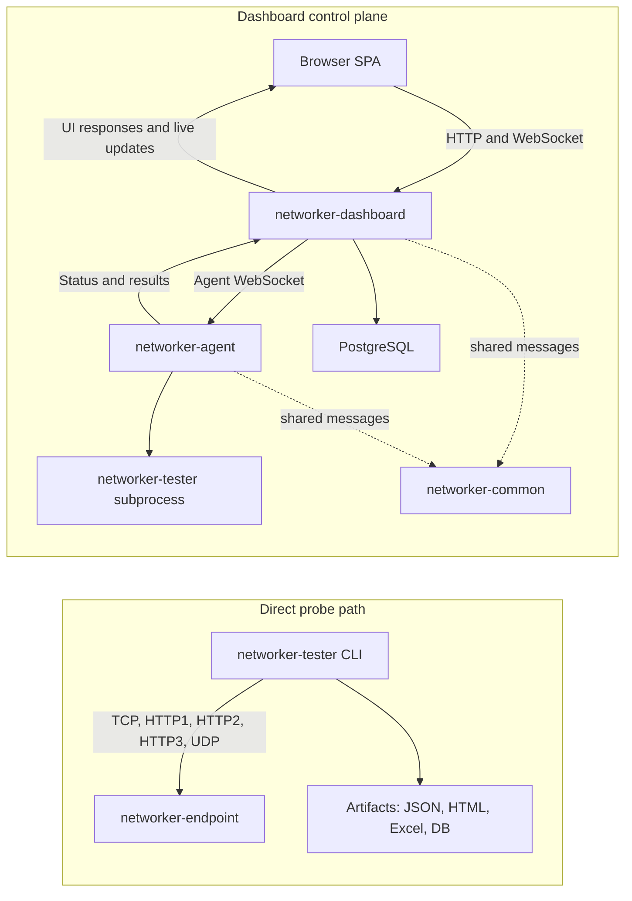
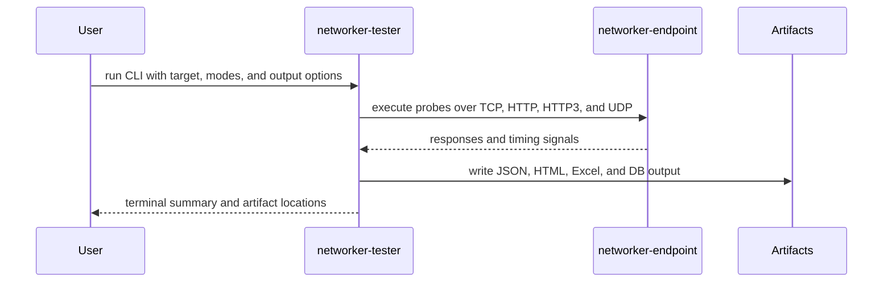
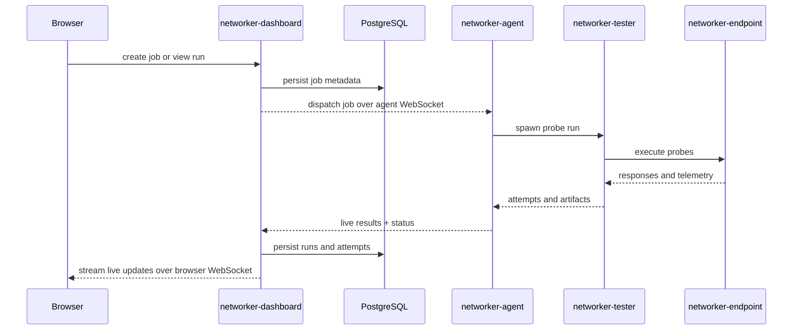
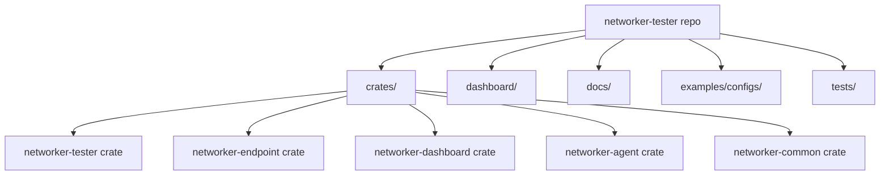

# Architecture

This repository has two closely related runtime paths: the direct probe path and the dashboard
control-plane path.

## System Overview

## Main Components

| Path | Role |
|------|------|
| `crates/networker-tester` | Probe engine and CLI. Runs the protocol tests and writes artifacts. |
| `crates/networker-endpoint` | Target HTTP/HTTPS/UDP service used for controlled measurements. |
| `crates/networker-dashboard` | REST API, WebSocket hubs, auth, scheduling, deploy orchestration, static frontend hosting. |
| `crates/networker-agent` | Worker process that receives jobs and runs `networker-tester`. |
| `crates/networker-common` | Shared message and protocol types used by dashboard and agent. |
| `dashboard/` | React SPA for the browser UI. |

## Runtime Flows

### Direct CLI Flow

1. `networker-tester` targets one or more URLs or hosts.
2. It runs the selected probes against `networker-endpoint` or another compatible target.
3. It writes artifacts such as JSON, HTML, Excel, and optional DB output.

### Dashboard-Managed Flow

1. A browser connects to the dashboard UI.
2. The React SPA talks to `networker-dashboard` over HTTP and WebSocket.
3. The dashboard dispatches work to one or more `networker-agent` workers.
4. Each agent runs `networker-tester` jobs locally and streams results back.
5. The dashboard persists state in PostgreSQL and fans live updates back to browsers.

## What Lives Where

## Reading Order For New Contributors

1. Read the root [`README.md`](../README.md) for the product overview and quick start.
2. Read [`installation.md`](installation.md) to build and run the core binaries.
3. Read [`probes.md`](probes.md) to understand which modes map to which measurements.
4. Read [`testing.md`](testing.md) for reproducible workflows and report interpretation.
5. Read [`deploy-config.md`](deploy-config.md) if you are working on installer-driven deployment.

## Where to Read Next

- [`installation.md`](installation.md)
- [`probes.md`](probes.md)
- [`deploy-config.md`](deploy-config.md)
- [`testing.md`](testing.md)
